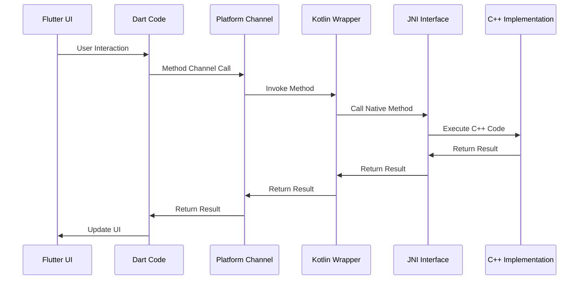
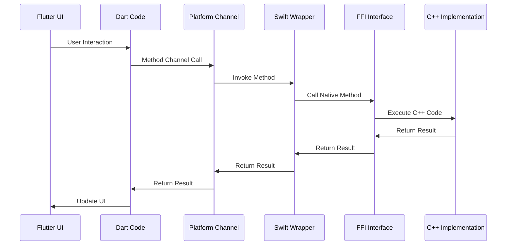

# flutter_cpp_basic

A Flutter project for learning C++ porting in Flutter by creating three separate packages: Counter, Data Transformer, and File Analyzer.

## Project Overview

This project demonstrates how to integrate C++ code with Flutter applications through platform-specific implementations on Android and iOS. It serves as a learning resource for understanding the communication patterns between Flutter and native C++ code.

## Packages

### 1. Counter Package
A simple counter implementation that demonstrates basic C++ integration with Flutter.

### 2. Data Transformer Package
A package that transforms data using C++ algorithms, showcasing more complex data processing.

### 3. File Analyzer Package
A package that analyzes file metadata using C++ to extract file information like size, inode, timestamps, etc.

## Architecture

The project follows a layered architecture where Flutter communicates with platform-specific code (Kotlin/Java for Android, Swift/Objective-C for iOS), which in turn interfaces with C++ implementations.

### Android Data Flow



### iOS Data Flow



## Android Implementation Details

### Step-by-Step Process

1. **Flutter to Dart Communication**
   - User interacts with the Flutter UI
   - Dart code handles the interaction and prepares the method channel call

2. **Dart to Platform Channel**
   - Dart invokes a method on the platform channel
   - The platform channel routes the call to the appropriate platform-specific implementation

3. **Platform Channel to Kotlin**
   - Android's platform channel receives the method call
   - Kotlin wrapper code is invoked with the provided parameters

4. **Kotlin to JNI**
   - Kotlin code uses JNI (Java Native Interface) to call C++ functions
   - Parameters are marshaled between JVM and native code

5. **JNI to C++**
   - JNI bridges the call to the actual C++ implementation
   - C++ code executes the requested operation

6. **Return Path**
   - Results flow back through the same layers in reverse order
   - Each layer handles any necessary data transformations

### Key Android Files

- `android/app/src/main/kotlin/com/example/flutter_cpp_basic/CounterWrapper.kt`
- `android/app/src/main/kotlin/com/example/flutter_cpp_basic/DataTransformerWrapper.kt`
- `android/app/src/main/kotlin/com/example/flutter_cpp_basic/FileInfoWrapper.kt`
- `android/app/src/main/cpp/counter/counter.cpp`
- `android/app/src/main/cpp/data_transformer/data_transformer.cpp`
- `android/app/src/main/cpp/file_info/file_info.cpp`

## iOS Implementation Details

### Step-by-Step Process

1. **Flutter to Dart Communication**
   - User interacts with the Flutter UI
   - Dart code handles the interaction and prepares the method channel call

2. **Dart to Platform Channel**
   - Dart invokes a method on the platform channel
   - The platform channel routes the call to the appropriate platform-specific implementation

3. **Platform Channel to Swift**
   - iOS's platform channel receives the method call
   - Swift wrapper code is invoked with the provided parameters

4. **Swift to FFI**
   - Swift code uses FFI (Foreign Function Interface) to call C++ functions
   - Objective-C++ wrappers are often used to bridge Swift and C++

5. **FFI to C++**
   - FFI bridges the call to the actual C++ implementation
   - C++ code executes the requested operation

6. **Return Path**
   - Results flow back through the same layers in reverse order
   - Each layer handles any necessary data transformations

### Key iOS Files

- `ios/Runner/NativeModules/Counter/CounterPlugin.swift`
- `ios/Runner/NativeModules/Counter/CounterWrapper.mm`
- `ios/Runner/NativeModules/DataTransformer/DataTransformerPlugin.swift`
- `ios/Runner/NativeModules/DataTransformer/DataTransformerWrapper.mm`
- `ios/Runner/NativeModules/FileInfo/FileInfoPlugin.swift`
- `ios/Runner/NativeModules/FileInfo/FileInfoWrapper.mm`
- `ios/Runner/NativeModules/Counter/cpp/counter.cpp`
- `ios/Runner/NativeModules/DataTransformer/cpp/data_transformer.cpp`
- `ios/Runner/NativeModules/FileInfo/cpp/file_info.cpp`

## Creating a C++ Plugin for Flutter

This section provides a tutorial on the files needed to create a C++ plugin for both Android and iOS platforms.

### Android Implementation

#### Required Files

1. **Kotlin Wrapper** (`android/app/src/main/kotlin/com/example/flutter_cpp_basic/YourPluginWrapper.kt`)
   - Handles communication between Flutter platform channel and C++ code
   - Uses JNI (Java Native Interface) to call C++ functions

   ```kotlin
   class YourPluginWrapper {
       companion object {
           init {
               System.loadLibrary("your_plugin")
           }
       }
       
       external fun yourNativeMethod(param: String): String
   }
   ```

2. **CMakeLists.txt** (`android/app/CMakeLists.txt`)
   - Build configuration for C++ code
   - Add your C++ source files here

   ```cmake
   add_library( # Sets the name of the library.
                your_plugin
                # Sets the library as a shared library.
                SHARED
                # Provides a relative path to your source file(s).
                src/main/cpp/your_plugin/your_plugin.cpp)
   ```

3. **C++ Header** (`android/app/src/main/cpp/your_plugin/your_plugin.h`)
   - Declares the functions that will be implemented in C++

   ```cpp
   #ifndef YOUR_PLUGIN_H
   #define YOUR_PLUGIN_H
   
   #include <jni.h>
   #include <string>
   
   extern "C" JNIEXPORT jstring JNICALL
   Java_com_example_flutter_1cpp_1basic_YourPluginWrapper_yourNativeMethod(
           JNIEnv* env,
           jobject /* this */,
           jstring param);
   
   #endif // YOUR_PLUGIN_H
   ```

4. **C++ Implementation** (`android/app/src/main/cpp/your_plugin/your_plugin.cpp`)
   - Implements the actual C++ functionality

   ```cpp
   #include "your_plugin.h"
   #include <android/log.h>
   
   extern "C" JNIEXPORT jstring JNICALL
   Java_com_example_flutter_1cpp_1basic_YourPluginWrapper_yourNativeMethod(
           JNIEnv* env,
           jobject /* this */,
           jstring param) {
       
       const char* nativeParam = env->GetStringUTFChars(param, 0);
       
       // Your C++ implementation here
       std::string result = "Processed: " + std::string(nativeParam);
       
       env->ReleaseStringUTFChars(param, nativeParam);
       return env->NewStringUTF(result.c_str());
   }
   ```

5. **Platform Channel Handler** (`lib/plugins/your_plugin.dart`)
   - Dart code that communicates with the platform channel

   ```dart
   class YourPlugin {
       static const MethodChannel _channel = MethodChannel('your_plugin');
       
       static Future<String> yourMethod(String param) async {
           final String result = await _channel.invokeMethod('yourMethod', param);
           return result;
       }
   }
   ```

### iOS Implementation

#### Required Files

1. **Swift Plugin** (`ios/Runner/NativeModules/YourPlugin/YourPluginPlugin.swift`)
   - Handles communication between Flutter platform channel and C++ code
   - Uses Objective-C++ wrappers to interface with C++

   ```swift
   import Flutter
   import UIKit
   
   public class YourPluginPlugin: NSObject, FlutterPlugin {
       public static func register(with registrar: FlutterPluginRegistrar) {
           let channel = FlutterMethodChannel(name: "your_plugin", binaryMessenger: registrar.messenger())
           let instance = YourPluginPlugin()
           registrar.addMethodCallDelegate(instance, channel: channel)
       }
       
       public func handle(_ call: FlutterMethodCall, result: @escaping FlutterResult) {
           if call.method == "yourMethod" {
               guard let args = call.arguments as? [String: Any],
                     let param = args["param"] as? String else {
                   result(FlutterError(code: "INVALID_ARGUMENT", message: "Invalid arguments", details: nil))
                   return
               }
               
               let response = YourPluginWrapper.process(param)
               result(response)
           } else {
               result(FlutterMethodNotImplemented)
           }
       }
   }
   ```

2. **Objective-C++ Wrapper** (`ios/Runner/NativeModules/YourPlugin/YourPluginWrapper.mm`)
   - Bridges Swift and C++ code
   - Uses Objective-C++ to call C++ functions

   ```objectivec
   #import "YourPluginWrapper.h"
   #import "your_plugin.hpp"
   
   @implementation YourPluginWrapper
   
   + (NSString *)process:(NSString *)param {
       std::string cppParam = std::string([param UTF8String]);
       std::string result = your_cpp_function(cppParam);
       return [NSString stringWithUTF8String:result.c_str()];
   }
   
   @end
   ```

3. **Objective-C Header** (`ios/Runner/NativeModules/YourPlugin/YourPluginWrapper.h`)
   - Declares the interface for the Objective-C++ wrapper

   ```objectivec
   #import <Foundation/Foundation.h>
   
   NS_ASSUME_NONNULL_BEGIN
   
   @interface YourPluginWrapper : NSObject
   
   + (NSString *)process:(NSString *)param;
   
   @end
   
   NS_ASSUME_NONNULL_END
   ```

4. **C++ Header** (`ios/Runner/NativeModules/YourPlugin/cpp/your_plugin.hpp`)
   - Declares the C++ functions

   ```cpp
   #ifndef YOUR_PLUGIN_HPP
   #define YOUR_PLUGIN_HPP
   
   #include <string>
   
   std::string your_cpp_function(const std::string& param);
   
   #endif // YOUR_PLUGIN_HPP
   ```

5. **C++ Implementation** (`ios/Runner/NativeModules/YourPlugin/cpp/your_plugin.cpp`)
   - Implements the actual C++ functionality

   ```cpp
   #include "your_plugin.hpp"
   
   std::string your_cpp_function(const std::string& param) {
       // Your C++ implementation here
       return "Processed: " + param;
   }
   ```

6. **Platform Channel Handler** (`lib/plugins/your_plugin.dart`)
   - Dart code that communicates with the platform channel (same as Android)

   ```dart
   class YourPlugin {
       static const MethodChannel _channel = MethodChannel('your_plugin');
       
       static Future<String> yourMethod(String param) async {
           final String result = await _channel.invokeMethod('yourMethod', param);
           return result;
       }
   }
   ```

### Common Steps for Both Platforms

1. **Register the Plugin**
   - Android: Register in MainActivity.kt
   - iOS: Register in AppDelegate.swift

2. **Add Dependencies**
   - Android: Update CMakeLists.txt
   - iOS: Add C++ files to Xcode project

3. **Test the Plugin**
   - Create a simple Flutter app to test the plugin functionality
   - Ensure proper error handling and edge cases

## Getting Started

This project is a starting point for a Flutter application that demonstrates C++ integration.

### Prerequisites

- Flutter SDK
- Android Studio / Xcode
- C++ knowledge (basic)

### Building the Project

1. Clone the repository
2. Run `flutter pub get` to install dependencies
3. For Android: Open in Android Studio and build
4. For iOS: Open in Xcode and build

### Learning Resources

- [Flutter Platform Channels](https://docs.flutter.dev/development/platform-integration/platform-channels)
- [Android NDK Documentation](https://developer.android.com/ndk/guides)
- [iOS Native Development](https://developer.apple.com/documentation/swift)
- [C++ for Flutter](https://flutter.dev/docs/development/platform-integration/c-interop)

For help getting started with Flutter development, view the
[online documentation](https://docs.flutter.dev/), which offers tutorials,
samples, guidance on mobile development, and a full API reference.
